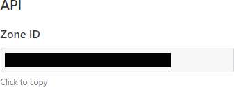

# Purpose
checking current ip address and update it in cloudflare DNS. Can be used programatically e.g. with cronjobs
## setup
either use the binary or clone the repository and build it yourself
e.g.
```
git clone git@github.com:trasba/cloudflare-dns-updater.git
```
get the dependencies
```
go get -d ./...
```
build the binary
```
go build cloudflare-dns-updater
```
make it executeable
```
chmod +x cloudflare-dns-updater
```
## configuration
setup config file:
e.g.:
```
cd cloudflare-dns-updater
cp config.example.json config.json
```
edit config.json to suite your needs e.g. with nano

```
nano config.json
```
```
{
    "token": "SDLJGHWijhgjhse_wr2234s",
    "zone_id": "bcdf876bcdf6536df",
    "dns_id": "bcd345345bdfe324",
    "ipvX": "ipv6"
}
```
**token:** can be created on cloudflare website go to: [https://dash.cloudflare.com/profile/api-tokens](https://dash.cloudflare.com/profile/api-tokens)  
**zone_id:** can be found in the cloudflare Dashboard. [https://dash.cloudflare.com/](https://dash.cloudflare.com/) Select your Zone and scroll down or search for Zone it will look like this.  
  
  
  
**dns_id:** You need to extract it via the api. Easiest way is using curl. Replace \<use zone_id\> and \<use token\> with the actual values   
```
curl -X GET "https://api.cloudflare.com/client/v4/zones/<use zone_id>/dns_records" \
      -H "Content-Type:application/json" \
      -H "Authorization: Bearer <use token>" 
```
Now you need to find the dns record you want to use. It might look something like this:  
```
{"id":"bcd345345bdfe324","type":"AAAA","name":"example.com",
```
**ipvX:** can either be ipv4 or ipv6 (make sure the type is AAA for ipv6 and A for ipv4)
that's all
## usage
run cloudflare-dns-updater
```
./cloudflare-dns-updater
```
**Thats it**
